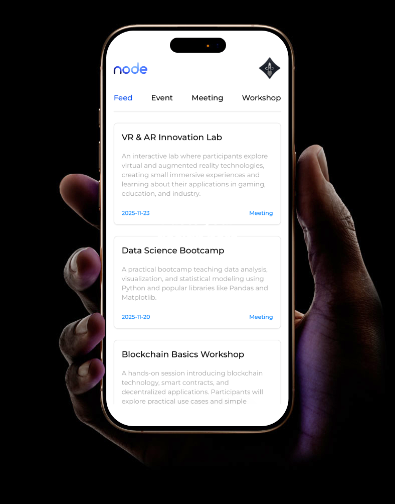

# NODE | IEEE



Stay updated with **IEEE** events, workshops, and meetings in one sleek, minimal feed.

## 🛠️ Getting Started

Follow these steps to set up and run the project locally.

1.  **Clone the repository:**
    ```bash
    git clone https://github.com/AkashSasikumar47/ieee-node.git
    ```
2.  **Install dependencies:**
    ```bash
    cd ieee-node
    npm install
    ```
3.  **Run the development server:**
    ```bash
    npm run dev
    ```
    Open [http://localhost:3000](http://localhost:3000) to view it in your browser.

---

## 📜 License

This project is open-source and code is licensed under the **MIT License**.
